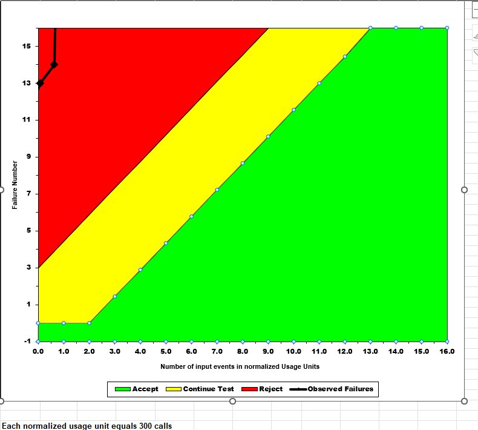

**SENG 438- Software Testing, Reliability, and Quality**

**Lab. Report \#5 – Software Reliability Assessment**

| Group \#: 18     |     
| -------------- |
| Student Names: |     
|Abdul Rafay        |    
|Mohammed Azmath Khan|
|Taiwu Chen           |     
|Hashir Naved         | 

# Introduction
The objective of this lab was to analyze integration test data using reliability assessment tools. The two methods that were implemented in order to assess the failure data were reliability growth testing and reliability demonstration charts (RDC) for the reliability assessment. This lab also provides the opportunity to compare different reliability assessments to inspect the pros and cons of each and improve future decisions on tool usage.

# Assessment Using Reliability Growth Testing
## Result of model comparison (selecting top two models)
Using the C-SFRAT tool, we were able to plot all the models and covariates and analyze the trend between the plotted data. The models selected include:

- IFR Salvia and Bollinger
- S Distribution
- Discrete Weibull (Order 2)
- IFR Generalized Salvia and Bollinger
- Negative Binomial (Order 2)
- Geometric
- Truncated Logistic

hen finding the best two models, C-SFRAT made it easy to compare the different models using the model comparison tab which allowed us to see which one would fit the best into our failure data. We used the Log-Likelihood to determine which fit best as it is used as a way to measure the goodness of fit for a model.
  
Figure 1 - Two best models (S on E,F,C) and (NB2 on E,F,C)

## Result of range analysis (an explanation of which part of data is good for proceeding with the analysis)
We decided to use all of the range because:
- A good model fit appears along the entire duration which suggests that collected data conforms to projected reliability growth trends.
- This data interval shows no indications of problems or disturbances that should warrant removing any sections.
- The inclusion of this entire dataset ensures maximum data availability which produces statistics-based reliable estimations of reliability growth parameters.
- The range extends through the entire test time from start to finish abecause it demonstrates the entire pattern of reliability growth for the system.

## Plots for failure rate and reliability of the SUT for the test data provided
  
Figure 2 - MVF Graph

  
Figure 3 - Failure Intensity Graph

  
Figure 4 - Reliability Graph Prediction

## A discussion on decision making given a target failure rate
  
Figure 5 - Failure Intensity Graph With 0.1 Target Failure Intensity
For deciding on the failure rate target we used the C-SFRAT tool again to help us predict the testing of the new prediction intervals. We were able to make a target the failure rate being which is dividing the failure numbers by the total number of hours the system is running. Failure rate also helps us in determining how much we need to improve our testing in order to bring this rate down in order to gain assurance on the number of failures the system would experience when released to the end-users. Our aim was to have the lowest possible rate we could to ensure the reliability of the failure data given to us is not at a dangerous level in terms of the safety of the application. With our two predictions, we wanted to set a target of the failure rate to be 0.1 as this was the lowest intensity for both of the models in the desired intervals for the intensity graph displayed in the above section. With this target failure rate, the failure data shall provide reliability to the system under the testing where this data originated from.

 ## A discussion on the advantages and disadvantages of reliability growth analysis

Advantages:
- Reliability Growth Testing produces visualized graphs that shows the failure rates (relationship between failure to time intervals), which are important when developing a product.
- RTG is also used to predict the data behaviour in the future to provide us information for making decisions on the product. Specifically, we can use the average failure rates in a range of intervals to calculate the System Reliabilty which is used to identify the remaining bugs and remaining time that is needed to remove the excessive bugs.
- RTG allows us to backtrack the causes of system failures by identifying the highest failure peaks.

Disavantages:
- It depends on large number of fail cases in order to be accurate.
- There can be a lot of noisy data when analyzing the inputs and drawing the graphs.
- The graphs are difficult to understand and need high level knowledge in statistic and quality assurance to utilize it

# Assessment Using Reliability Demonstration Chart 

## Using the RDC Tool for Reliability Demonstration

For the second part of the assignment, we used the Reliability Demonstration Chart (RDC) Excel tool to evaluate the reliability of a hypothetical system using observed failure data. This method allowed us to determine whether the software met specific reliability objectives based on a visual analysis of failure occurrences over normalized usage time.

## Input Data & Setup

We used the provided failure dataset DATA1.DAT, which includes time to failure data points in minutes (T(i)) and failure counts (C(i)). From this dataset, the following were selected for analysis:

-   Failure Counts (E column):
    1, 2, 3, 4, 5, 6, 8, 9, 10, 11, 12, 13, 14, 19, 20, 21
    (Failure IDs based on cumulative counts from the data)

-   Time of Failures (minutes) (F column):
    36, 40, 45, 52, 54, 102, 108, 172, 197, 200, 242, 326, 491, 514, 537, 580
    (Used as input events to calculate the normalized failure time)

We tested three different MTTF (Mean Time To Failure) thresholds by adjusting the unitary FIO (Failure Intensity Objective):

-   150 calls

-   300 calls

-   600 calls

This helped us assess the acceptability of the software under different reliability expectations.

## Observation of the Graphs

In all three cases (150, 300, and 600), the failure data line (Observed Failures) fell completely inside the red region, which indicates rejection of the system’s reliability based on the specified MTTF. This means that:

-   The failure rate is too high for any of the proposed MTTF values.

-   The observed failures do not meet the reliability objectives at the confidence level assumed by the RDC.

Figure 1 - RDC Chart showing the system fails to meet MTTF 150 thresholds failure observation fall in the reject zone.

Figure 2 - MTTF = 300

Figure 3 - MTTF = 600, out of red range.

Figure 4 - Input failure observations normalized using an MTTF of 600 calls, showing cumulative failures, time of observation, and computed normalized usage units for RDC visualization.

## A Discussion on the Advantages and Disadvantages of RDC

### Advantages:

-   Simple Visual Analysis:
    The RDC provides a clear visual indicator (green, yellow, red) that instantly shows whether a system's reliability is acceptable, marginal, or unacceptable, making it accessible even for those without deep statistical backgrounds.

-   Fast and Lightweight:
    Unlike reliability growth tools that require modeling and distribution fitting, RDC can quickly give insight using minimal data, ideal when only failure counts and times are known.

-   What If Scenario Testing:
    It allows easy adjustment of MTTF targets and confidence levels to test system reliability under various assumptions, supporting informed decision making during early testing stages.

-   Low Learning Curve:
    Since RDC is Excel based with manual inputs, it’s approachable for most QA engineers without needing to install complex software tools or learn coding.

### Disadvantages:

-   Lack of Statistical Depth:
    The RDC does not provide confidence intervals, model fitting, or predictive analytics. It’s useful for accept/reject decisions but lacks deeper reliability insights.

-   Binary Outcomes:
    The method is limited to showing whether the system passes or fails for a specific MTTF. It doesn't help understand how to improve reliability or predict future failure trends.

-   Not Scalable for Large Datasets:
    With limited cell space and manual input, the RDC tool isn’t ideal for large scale software systems with hundreds of failures or time points.

-   Over Sensitivity to Early Failures:
    A few failures early in testing can skew the outcome significantly, leading to a full rejection even if reliability improves later on.

# Comparison of Results

# Discussion on Similarity and Differences of the Two Techniques

# How the team work/effort was divided and managed

# Using the RDC Tool for Reliability Demonstration

# Difficulties encountered, challenges overcome, and lessons learned

# Comments/feedback on the lab itself
